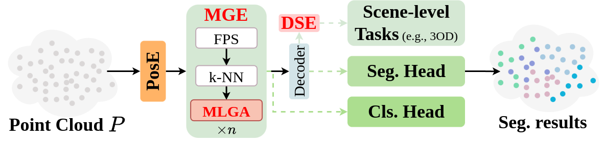

# PointeNet: A Lightweight Framework for Effective and Efficient Point Cloud Analysis

Official implementation of ['PointeNet: A Lightweight Framework for Effective and Efficient Point Cloud Analysis'](https://www.sciencedirect.com/science/article/abs/pii/S0167839624000451).

The paper has been accepted by **Computer Aided Geometric Design** 🔥.

## News
* The code of PointeNet has been released 📌.

## Introduction
The conventional wisdom in point cloud analysis predominantly explores 3D geometries. 
It is often achieved through the introduction of intricate learnable geometric extractors in the encoder or by deepening networks with repeated blocks. 
However, these methods contain a significant number of learnable parameters, resulting in substantial computational costs and imposing memory burdens on CPU/GPU. 
Moreover, they are primarily tailored for object-level point cloud classification and segmentation tasks, with limited extensions to crucial scene-level applications, such as autonomous driving. 
To this end, we introduce **PointeNet**, an **e**fficient **net**work designed specifically for **point** cloud analysis. 
PointeNet distinguishes itself with its lightweight architecture, low training cost, and plug-and-play capability, while also effectively capturing representative features. 
The network consists of a Multivariate Geometric Encoding (MGE) module and an optional Distance-aware Semantic Enhancement (DSE) module. 
MGE employs operations of sampling, grouping, pooling, and multivariate geometric aggregation to lightweightly capture and adaptively aggregate multivariate geometric features, providing a comprehensive depiction of 3D geometries. 
DSE, designed for real-world autonomous driving scenarios, enhances the semantic perception of point clouds, particularly for distant points. 
Our method demonstrates flexibility by seamlessly integrating with a classification/segmentation head or embedding into off-the-shelf 3D object detection networks, achieving notable performance improvements at a minimal cost. 
Extensive experiments on object-level datasets, including ModelNet40, ScanObjectNN, ShapeNetPart, and the scene-level dataset KITTI, demonstrate the superior performance of PointeNet over state-of-the-art methods in point cloud analysis. 
Notably, PointeNet outperforms PointMLP with significantly fewer parameters on ModelNet40, ScanObjectNN, and ShapeNetPart, and achieves a substantial improvement of over 2% in _3D AP-R40_ for PointRCNN on KITTI with a minimal parameter cost of 1.4 million.

<div align="center">
  
</div>

## Requirements
### Installation
Create a conda environment and install dependencies:
```bash
# step 1. clone this repo
git clone https://github.com/lipeng-gu/PointeNet.git
cd PointeNet

# step 2. create a conda virtual environment and activate it
conda create -n pointenet python=3.7 -y
conda activate pointenet
conda install pytorch torchvision cudatoolkit
pip install cycler einops h5py pyyaml scikit-learn scipy tqdm matplotlib
pip install pointnet2_ops_lib/.
```

### Dataset
Please download the following datasets: [ModelNet40](https://shapenet.cs.stanford.edu/media/modelnet40_ply_hdf5_2048.zip), [ScanObjectNN](https://hkust-vgd.ust.hk/scanobjectnn/h5_files.zip), and [ShapeNetPart](https://shapenet.cs.stanford.edu/media/shapenetcore_partanno_segmentation_benchmark_v0_normal.zip). Then, create a `data/` folder and organize the datasets as
```
PointeNet
|--classification_ModelNet40
|---- data/
|––---- modelnet40_ply_hdf5_2048/
|--classification_ScanObjectNN
|---- data/
|––---- h5_files/
|--part_segmentation
|---- data/
|––---- shapenetcore_partanno_segmentation_benchmark_v0_normal/
```

## Useage
### Shape Classification
For the ModelNet40 dataset, just run:
```bash
cd classification_ModelNet40
python main.py --model PointeNet --msg <output filename>
```

For the ScanObjectNN dataset, just run:
```bash
cd classification_ScanObjectNN
python main.py --model PointeNet --msg <output filename>
```

### Part Segmentation
For the ShapeNetPart dataset, just run:
```bash
python main.py --model PointeNet --exp_name <output filename>
```


## Citation
```bash
@article{gu2024pointenet,
  title={PointeNet: A lightweight framework for effective and efficient point cloud analysis},
  author={Gu, Lipeng and Yan, Xuefeng and Nan, Liangliang and Zhu, Dingkun and Chen, Honghua and Wang, Weiming and Wei, Mingqiang},
  journal={Computer Aided Geometric Design},
  pages={102311},
  year={2024},
  publisher={Elsevier}
}
```


